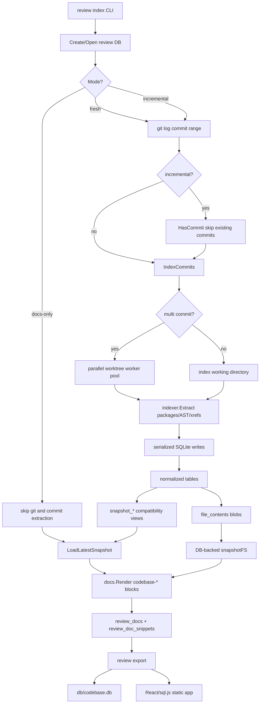

# Full Architecture and Code Review After Review-Indexing Optimizations

## Audience and goal

This document is for a new intern joining the `codebase-browser` project after the GCB-017 performance work. It explains what the review indexing system is, how the optimized architecture now works, which files matter, and where the code is still unclear, risky, deprecated, or in need of cleanup.

The review is intentionally technical. It includes prose, diagrams, pseudocode, file references, API references, and concrete refactoring sketches. The aim is not just to say "this code is good" or "this code is bad", but to teach the mental model required to safely continue optimizing the system.

## Executive summary

The GCB-017 work substantially improved review indexing:

- The review DB moved from full per-commit snapshots to a normalized schema with base entity tables plus commit mapping tables.
- Compatibility views preserve the old `snapshot_*` query interface used by the browser and SQL examples.
- Incremental indexing skips commits already present in the DB.
- Parallel indexing extracts multiple worktrees concurrently while serializing SQLite writes.
- Docs-only indexing re-renders review markdown without re-extracting commits.
- Markdown snippet rendering now uses DB-backed file contents in the `review index` path, avoiding live-checkout/source-offset mismatches.

The work is directionally strong. The largest improvement is architectural: we now store semantic entity versions once and map them to commits. Glazed benchmarks confirm the design: 123 commits produced a 2.7 MB DB instead of an estimated ~88 MB old-schema DB, and 252 commits produced a 6.8 MB DB instead of an estimated ~175 MB.

The main remaining risks are around duplicated render paths, stale compatibility abstractions, hidden coupling between source bytes and symbol offsets, and code paths that still treat optimized normalized storage as if it were the old snapshot-table model.

## System mental model

`codebase-browser` turns a git commit range plus markdown review guides into a static browser artifact. The browser has no Go server at read time. It opens a SQLite database locally through sql.js and queries that DB directly.

The pipeline has four conceptual phases:

1. Resolve commits from a git range.
2. Extract source/package/file/symbol/ref snapshots for those commits.
3. Store commit history and file contents in SQLite.
4. Render markdown review guides into interactive widgets and export a static SPA.

The optimized pipeline looks like this:



## File map

### CLI layer

- `cmd/codebase-browser/cmds/review/index.go`
  - Main user command for indexing commits and markdown docs.
  - Owns flags: `--db`, `--repo-root`, `--commits`, `--docs`, `--patterns`, `--include-tests`, `--parallelism`, `--incremental`, `--docs-only`.

- `cmd/codebase-browser/cmds/review/db.go`
  - Commit-only database creation (`review db create`).
  - Useful for LLM/database analysis without review markdown.

- `cmd/codebase-browser/cmds/review/export.go`
  - Static export wrapper around `internal/staticapp.Export`.

- `cmd/codebase-browser/cmds/review/patterns.go`
  - Default extraction patterns: currently `./cmd/...` and `./internal/...`.

### Review orchestration layer

- `internal/review/indexer.go`
  - High-level orchestration for `review index`.
  - Handles commit indexing, incremental filtering, docs-only mode, doc discovery, and snippet storage.

- `internal/review/snapshot_fs.go`
  - Presents indexed `file_contents` as an `fs.FS` for markdown rendering.
  - Prevents symbol byte offsets from being applied to a changed live checkout.

- `internal/review/loader.go`
  - Reconstructs an `indexer.Index` for the latest commit from `snapshot_*` views.

- `internal/review/store.go`
  - Opens/creates the unified review DB and wraps the shared history store.

### History/indexing layer

- `internal/history/indexer.go`
  - Runs extraction either directly or through per-commit worktrees.
  - Contains the worker pool used by `--parallelism`.

- `internal/history/schema.go`
  - The normalized SQLite schema and compatibility views.

- `internal/history/loader.go`
  - The normalized bulk loader. Stores entities once and inserts commit mapping rows.

- `internal/history/cache.go`
  - Stores raw file bytes in `file_contents` keyed by SHA-256.

### Static export layer

- `internal/staticapp/export.go`
  - Builds/copies the React SPA, copies the DB, optionally renders review docs, writes `manifest.json`.

- `internal/staticapp/reviewdocs.go`
  - Re-renders review docs into `static_review_rendered_docs` inside the copied export DB.

### Browser/query layer

- `ui/src/api/sqlJsQueryProvider.ts`
  - Browser SQL queries read `commits`, `file_contents`, and `snapshot_*` views.
  - This file did not need major changes because compatibility views preserved old shapes.

## Schema architecture

The core optimization is the schema. The old design stored one full row per `(commit, entity)` in tables like `snapshot_symbols`. That was easy to query but catastrophically redundant.

The new design stores:

- one row per commit in `commits`
- one row per unique package in `packages`
- one row per unique file version in `files`
- one row per unique symbol version in `symbols`
- one row per unique reference version in `ref_versions`
- narrow mapping rows in `commit_packages`, `commit_files`, `commit_symbols`, `commit_refs`

The logical model is:

```text
commit C contains symbol version S
        -> commit_symbols(commit_id=C.id, symbol_id=S.id)

symbol version S has stable semantic identity and version hash
        -> symbols(stable_id='sym:...', body_hash='...')
```

The browser still sees:

```sql
SELECT * FROM snapshot_symbols WHERE commit_hash = ?;
```

But `snapshot_symbols` is now a view:

```sql
commit_symbols -> commits -> symbols -> packages/files
```

That is the key architectural compromise: normalized storage underneath, old query interface on top.

## Detailed code review findings

### 1. Static export still renders docs from the live filesystem

Problem: The `review index` path was fixed to render snippets from DB-backed file contents, but `review export` still re-renders review docs using `os.DirFS(repoRoot)`. This reintroduces the exact correctness problem docs-only fixed: symbol offsets come from the indexed DB, while source bytes can come from a changed checkout.

Where to look:

- `internal/review/indexer.go` now uses `snapshotFS` for indexing docs.
- `internal/staticapp/reviewdocs.go:74-78` still does:

```go
sourceFS := os.DirFS(repoRoot)
...
page, renderErr := docs.Render(slug, []byte(content), loaded, sourceFS)
```

Why it matters: Export-time rendered pages can disagree with index-time snippets. In the happy path, `review index` stores `review_doc_snippets`, but `review export` recomputes rendered docs from raw markdown. If the repo moved, the exported static browser can contain snippet text/errors different from the indexed review DB.

Cleanup sketch:

```go
loaded, latestHash := review.LoadLatestSnapshotWithHash(ctx, store)
sourceFS := review.NewSnapshotFS(store.DB(), latestHash)
page, err := docs.Render(slug, []byte(content), loaded, sourceFS)
```

Better still, avoid re-resolving snippets at export if `review_doc_snippets` already contains resolved snippet data. Export should render markdown placeholders and attach already-resolved snippet metadata from the DB.

Severity: High correctness risk.

### 2. `snapshotFS` is correct in spirit but should not use `context.Background()`

Problem: `snapshotFS.Open` ignores caller cancellation and uses `context.Background()` for database queries.

Where to look: `internal/review/snapshot_fs.go:31-37`

```go
err := s.db.QueryRowContext(context.Background(), `
SELECT fc.content
FROM snapshot_files f
JOIN file_contents fc ON fc.content_hash = f.sha256
WHERE f.commit_hash = ? AND f.path = ?
`, s.commitHash, clean).Scan(&content)
```

Why it matters: `fs.FS` does not carry a context, so this is understandable. But if doc rendering is running under a cancelled command context, SQLite reads can continue until completion. This is usually small, but large file snippets can still be noticeable.

Cleanup sketch:

```go
type snapshotFS struct {
    ctx context.Context
    db *sql.DB
    commitHash string
}
```

Then instantiate with:

```go
sourceFS := snapshotFS{ctx: ctx, db: store.DB(), commitHash: latestHash}
```

Severity: Low-to-medium. Not urgent, but worth tightening.

### 3. Latest-commit selection is duplicated and based on `author_time`

Problem: The latest snapshot is selected in two places using `ORDER BY author_time DESC LIMIT 1`: `LoadLatestSnapshot` and `latestCommitHash`. This duplicates logic and uses author time as a proxy for latest indexed commit.

Where to look:

- `internal/review/loader.go:15-22`
- `internal/review/snapshot_fs.go:78-87`

Why it matters: Author timestamps are not a topological order. Merge commits, rebases, and imported commits can have surprising author dates. In glazed, author times were already odd enough to make reasoning about “latest” non-trivial. The commit range order used during indexing is not preserved in a dedicated column.

Cleanup sketch:

Add a stable ordering field:

```sql
ALTER TABLE commits ADD COLUMN sequence INTEGER NOT NULL DEFAULT 0;
CREATE INDEX idx_commits_sequence ON commits(sequence);
```

Then load latest by:

```sql
SELECT hash FROM commits ORDER BY sequence DESC LIMIT 1;
```

Or if schema changes are still cheap, add `range_index` at insert time.

Severity: Medium. The current behavior often works, but “latest” is semantically ambiguous.

### 4. `LoadLatestSnapshot` rebuilds an index through JSON as an unnecessary conversion step

Problem: `LoadLatestSnapshot` constructs an `indexer.Index`, marshals it to JSON, and then calls `browser.LoadFromBytes` to rebuild lookup maps.

Where to look: `internal/review/loader.go:24-35`

```go
data, err := json.Marshal(idx)
...
loaded, err := browser.LoadFromBytes(data)
```

Why it matters: This adds avoidable CPU allocation and hides what is actually needed: build `browser.Loaded` maps from an already-in-memory `indexer.Index`. On large repos, this JSON roundtrip is not the main bottleneck, but it is obscure and unnecessary.

Cleanup sketch:

```go
func browser.LoadIndex(idx *indexer.Index) (*Loaded, error) {
    loaded := &Loaded{Index: idx}
    loaded.buildMaps()
    return loaded, nil
}
```

Then:

```go
return browser.LoadIndex(idx)
```

Severity: Low-to-medium. Mostly clarity and allocation cleanup.

### 5. Normalized loader upsert pattern is repeated and hard to audit

Problem: `loadPackages`, `loadFiles`, `loadSymbols`, and `loadRefs` repeat the same pattern: `INSERT ... ON CONFLICT DO NOTHING RETURNING id`, then on `sql.ErrNoRows`, run a lookup query. Each prepared statement has hand-counted parameters.

Where to look:

- `internal/history/loader.go:69-108`
- `internal/history/loader.go:111-164`
- `internal/history/loader.go:167-263`
- `internal/history/loader.go:266-345`

Why it matters: This was already a source of bugs during implementation (`expected N arguments, got N+1`). It is the kind of code that works after careful testing but is easy to break during schema evolution.

Cleanup sketch:

Create a tiny helper around the pattern:

```go
func insertOrLookupID(ctx context.Context, insert *sql.Stmt, lookup func() *sql.Row, args ...any) (int64, error) {
    var id int64
    err := insert.QueryRowContext(ctx, args...).Scan(&id)
    if errors.Is(err, sql.ErrNoRows) {
        err = lookup().Scan(&id)
    }
    return id, err
}
```

For even better clarity, use `RETURNING id` with `ON CONFLICT DO UPDATE SET id = id`, though that performs a harmless update:

```sql
INSERT INTO packages(...)
VALUES (...)
ON CONFLICT(stable_id) DO UPDATE SET stable_id = excluded.stable_id
RETURNING id;
```

Severity: Medium maintainability issue.

### 6. `files.content_hash` is redundant with `files.sha256` and sometimes empty

Problem: `files` has both `sha256` and `content_hash`, but `loadFiles` inserts `content_hash` as `''`:

```sql
INSERT INTO files(..., sha256, ..., content_hash)
VALUES (..., ?, ..., '')
```

Where to look:

- `internal/history/schema.go:62-65`
- `internal/history/loader.go:115-117`
- `internal/review/snapshot_fs.go:33-36`

The new `snapshotFS` correctly joins `file_contents` using `f.sha256`, not `f.content_hash`:

```sql
JOIN file_contents fc ON fc.content_hash = f.sha256
```

Why it matters: Having both fields invites confusion. The compatibility view exposes `content_hash`, but it may be empty. Future code may join on `content_hash` and fail.

Cleanup sketch:

Option A: remove `content_hash` from `files` and from `snapshot_files` once consumers are audited.

Option B: populate it with the same value as `sha256`:

```sql
VALUES (..., ?, ..., ?)
-- pass f.SHA256 for both sha256 and content_hash
```

Severity: Medium. This is an obscure/deprecated-field smell.

### 7. `ref_versions` deduplication may be too aggressive across symbol versions

Problem: `ref_versions` uniqueness is `(from_symbol_id, to_stable_id, kind, file_id)`, with all locations collapsed into `locations_json`. This stores one location set per source symbol version, target stable ID, kind, and file version.

Where to look: `internal/history/schema.go:82-93`, `internal/history/loader.go:266-345`

Why it matters: The design is mostly sound because `from_symbol_id` is an integer symbol version and `file_id` is a file version. However, `to_stable_id` is not a target version. If the target symbol body changes but its stable ID does not, all refs to it still point only to the stable identity. This is probably intended for cross-reference navigation, but not for version-exact call graph analysis.

Cleanup sketch:

Document this explicitly:

```text
Refs are versioned by caller/file location, not by callee body version.
`to_stable_id` means “semantic target identity”; resolve it in the chosen commit
if you need target metadata.
```

If target-version exactness becomes important:

```sql
ALTER TABLE ref_versions ADD COLUMN to_symbol_id INTEGER NULL REFERENCES symbols(id);
```

Severity: Low now, medium if call graph history becomes more precise.

### 8. `snapshot_refs` view uses `row_number()` and `json_each()`; this is powerful but expensive

Problem: Every query against `snapshot_refs` expands JSON arrays using `json_each()` and computes row numbers with a window function.

Where to look: `internal/history/schema.go:179-204`

Why it matters: This was an excellent space optimization, but it pushes work to query time. For browser interactions that frequently query refs, the view can become a CPU hotspot in sql.js, where SQLite runs in WASM on the client.

Cleanup sketch:

Add targeted benchmark queries for browser ref access patterns:

```sql
SELECT * FROM snapshot_refs WHERE commit_hash = ? AND from_symbol_id = ?;
SELECT * FROM snapshot_refs WHERE commit_hash = ? AND to_symbol_id = ?;
```

If slow, consider a hybrid table:

```sql
CREATE TABLE ref_locations (
    ref_version_id INTEGER REFERENCES ref_versions(id),
    ordinal INTEGER,
    start_line INTEGER,
    ...,
    PRIMARY KEY(ref_version_id, ordinal)
) WITHOUT ROWID;
```

This keeps location deduplication but avoids JSON expansion.

Severity: Medium performance watch item.

### 9. Worker pool serializes file caching under the same mutex as snapshot writes

Problem: In `indexWithWorktrees`, each worker extracts concurrently, then serializes both `LoadSnapshot` and `CacheFileContents` under `mu`.

Where to look: `internal/history/indexer.go:117-139`

Why it matters: Serialization is necessary for SQLite writes, but `CacheFileContents` reads files from disk and performs SHA-256 hashing while holding the mutex. That reduces write concurrency and can turn file I/O into a global bottleneck.

Cleanup sketch:

Split cache into read phase and write phase:

```go
contents := readAndHashFiles(wt) // no DB mutex
mu.Lock()
insertContents(contents)         // short DB critical section
mu.Unlock()
```

Or use a single writer goroutine receiving write jobs:

```go
extract workers -> writeJob channel -> sqlite writer goroutine
```

Severity: Medium performance improvement opportunity.

### 10. Worker progress counts completions, not original commit order

Problem: With parallelism, progress lines are completion order, not commit range order.

Where to look: `internal/history/indexer.go:136-138`

Why it matters: This is mostly cosmetic, but it can confuse benchmark logs and review indexing diaries. The `commitJob.index` field exists but is unused.

Cleanup sketch:

Either remove `index` from `commitJob` or use it in progress output:

```go
opts.OnProgress(job.index+1, len(opts.Commits), commit.ShortHash, commit.Message)
```

But beware: that would display out-of-order numbers. Better wording might be `completed=N/total`.

Severity: Low.

### 11. Docs rendering errors are stored, but index CLI success semantics are still nuanced

Problem: `docs.Render` accumulates per-directive errors in `page.Errors` and emits visible doc-error markers in HTML. `indexDoc` treats the render itself as successful if `docs.Render` returns a page. The CLI returns non-zero only for hard errors, not for soft directive errors.

Where to look:

- `internal/docs/renderer.go` preprocess behavior
- `internal/review/indexer.go:indexDoc`
- `internal/staticapp/reviewdocs.go` stores `errors_json`

Why it matters: This is a product decision. For authoring, soft errors are useful: a review doc can still render with visible placeholders. For CI, unresolved snippets should probably fail.

Cleanup sketch:

Add a flag:

```bash
--strict-docs
```

Then:

```go
if opts.StrictDocs && len(page.Errors) > 0 {
    return 0, fmt.Errorf("doc has %d render errors", len(page.Errors))
}
```

Severity: Medium UX/CI policy decision.

### 12. `--include-source` in export is misleading for external repos

Problem: `Export` implements `IncludeSource` by copying `internal/sourcefs/embed/source` from the repo root:

```go
sourceSrc := filepath.Join(opts.RepoRoot, "internal", "sourcefs", "embed", "source")
```

Where to look: `internal/staticapp/export.go:64-71`

Why it matters: This path is codebase-browser-specific. When exporting glazed, `--include-source` failed because glazed does not have that directory. The flag name sounds generic but the implementation is not.

Cleanup sketch:

Rename or split behavior:

```text
--include-embedded-source   # current behavior, codebase-browser-specific
--include-repo-source       # copy selected indexed source files from DB/git
```

Or remove the flag if static runtime no longer needs a copied source tree because `file_contents` is in SQLite.

Severity: Medium documentation/API clarity issue.

### 13. Default patterns are narrow and surprising for external repos

Problem: Defaults are `./cmd/...` and `./internal/...`. That is good for this repo but misses `pkg/...`, `lib/...`, and many external layouts.

Where to look: `cmd/codebase-browser/cmds/review/patterns.go`

Why it matters: Glazed had important code under `pkg/` and examples under `cmd/examples`. A user can easily think the indexer is broken when symbols are simply not in the default patterns.

Cleanup sketch:

Options:

1. Change default to `./...`.
2. Keep current default but print it at start.
3. Add `--all-packages` shortcut.
4. Detect common directories and warn if they are excluded.

Severity: Medium UX issue.

### 14. Normalized schema is clean cutover, but schema versioning is absent

Problem: The user requested a clean cutover, so old schema compatibility is not required. But the DB still has no explicit schema version table. The export manifest has `schemaVersion: 1`, but the DB itself does not advertise its schema.

Where to look: `internal/history/schema.go`, `internal/staticapp/manifest.go`

Why it matters: Future code will need to distinguish normalized v2 DBs from older or partially-created DBs. `HasTables()` checks only whether `commits` exists.

Cleanup sketch:

```sql
CREATE TABLE schema_info (
    key TEXT PRIMARY KEY,
    value TEXT NOT NULL
);
INSERT INTO schema_info(key, value) VALUES ('history_schema_version', '2');
```

Severity: Medium future-proofing.

### 15. Review docs are re-rendered twice in normal export workflow

Problem: `review index` renders docs and stores snippets; `review export` re-renders raw markdown into `static_review_rendered_docs`.

Where to look:

- `internal/review/indexer.go:indexDoc`
- `internal/staticapp/reviewdocs.go:AddRenderedReviewDocs`

Why it matters: Two render paths can diverge. We already saw this with source FS differences. They also duplicate work and can produce different `errors_json` depending on checkout state.

Cleanup sketch:

Architectural split:

```text
review index:
  - raw markdown
  - resolved snippets
  - render errors

review export:
  - render markdown HTML shell from stored raw markdown
  - attach existing snippets/errors from DB
  - do not resolve symbols again
```

If export must render because HTML is not stored, make the renderer accept a pre-resolved snippet map.

Severity: High architectural cleanup opportunity.

## Deprecated or obscure code inventory

### `files.content_hash`

Current status: ambiguous/deprecated-looking. It is part of the old table shape but is not populated meaningfully in the normalized loader. Treat it as compatibility-only until removed or populated.

### `review export --include-source`

Current status: misleading for external repos. The implementation copies a codebase-browser-specific embedded source directory, not arbitrary repo source. This should be renamed, removed, or reimplemented.

### `LoadLatestSnapshot` JSON roundtrip

Current status: obscure adapter. It likely exists because `browser.LoadFromBytes` is the only public way to build lookup maps. Add a direct API.

### `commitJob.index`

Current status: unused. Remove or use in progress reporting.

### `delRes.RowsAffected()` discarded in `indexDoc`

Current status: harmless noise. If not used for logging/metrics, remove `delRes` entirely.

## API references and expected usage

### Fresh index

```bash
codebase-browser review index \
  --commits HEAD~50..HEAD \
  --docs ./reviews/ \
  --patterns ./... \
  --parallelism 4 \
  --db review.db
```

Call path:

```text
cmd/.../review/index.go
  -> review.Create(db)
  -> review.IndexReview
      -> gitutil.LogCommits
      -> history.IndexCommits
          -> indexWithWorktrees or indexDirect
          -> indexer.Extract
          -> history.Store.LoadSnapshot
          -> history.CacheFileContents
      -> review.LoadLatestSnapshot
      -> docs.Render
      -> review_docs/review_doc_snippets
```

### Incremental index

```bash
codebase-browser review index \
  --incremental \
  --commits HEAD~60..HEAD \
  --docs ./reviews/ \
  --db review.db
```

Expected behavior:

- Open existing DB.
- Resolve commit range.
- Skip commits already present.
- Index only new commits.
- Re-render docs.

### Docs-only index

```bash
codebase-browser review index \
  --docs-only \
  --docs ./reviews/ \
  --db review.db
```

Expected behavior:

- Open existing DB.
- Verify commits exist.
- Do not run git log.
- Do not extract packages.
- Load latest snapshot from DB.
- Render docs from DB-backed source bytes.
- Replace stale snippets atomically.

### Static export

```bash
codebase-browser review export \
  --db review.db \
  --out review-static
```

Current behavior:

- Build SPA.
- Copy SPA assets.
- Copy DB to `db/codebase.db`.
- Re-render review docs into `static_review_rendered_docs`.
- Write manifest.

Important caveat: export-time doc rendering currently uses live `repoRoot` source, not DB-backed `snapshotFS`.

## Recommended next tasks

- [ ] F1: Make `internal/staticapp/reviewdocs.go` use DB-backed snapshot content instead of `os.DirFS(repoRoot)`.
- [ ] F2: Add direct `browser.LoadIndex(*indexer.Index)` API and remove JSON roundtrip in `LoadLatestSnapshot`.
- [ ] F3: Decide whether `files.content_hash` should be removed or populated with `sha256`; update views/docs accordingly.
- [ ] F4: Add schema version table inside the SQLite DB.
- [ ] F5: Add browser-query benchmarks for `snapshot_refs` expansion under sql.js-like workloads.
- [ ] F6: Refactor normalized loader upsert helpers to reduce hand-counted SQL argument lists.
- [ ] F7: Split file content caching into read/hash outside the SQLite writer lock and insert inside a short critical section.
- [ ] F8: Add `--strict-docs` to fail on unresolved `codebase-*` directive errors.
- [ ] F9: Clarify or replace `--include-source` for external repos.
- [ ] F10: Revisit default package patterns; consider `./...` or an `--all-packages` shortcut.

## What a new intern should learn from this work

The biggest lesson is that performance work often changes the shape of the system. We did not merely make an SQL query faster; we changed the physical model of history from “copy a whole snapshot for every commit” to “store entity versions once and map them to commits.” That unlocks 20x–30x smaller DBs, but it also creates new responsibilities:

- Views become part of the public API.
- “Latest” must be defined carefully.
- Source bytes and symbol offsets must come from the same snapshot.
- Export and index paths must not resolve docs differently.
- Convenience compatibility fields like `content_hash` can become misleading if not maintained.

The second lesson is that concurrency and SQLite can work well together if the boundary is explicit. Parallel extraction is safe because AST/worktree extraction happens outside the database, while writes are serialized. But serialization should be as short as possible; holding the write mutex while hashing files is probably leaving performance on the table.

The third lesson is that optimized systems need better tests than ordinary systems. The FK bug was not hard once the right invariant was stated: every snippet row must reference the actual doc row for its slug. The test suite now covers that path, but the export/render duplication still needs tests that mutate the live checkout after indexing and verify static export remains stable.
